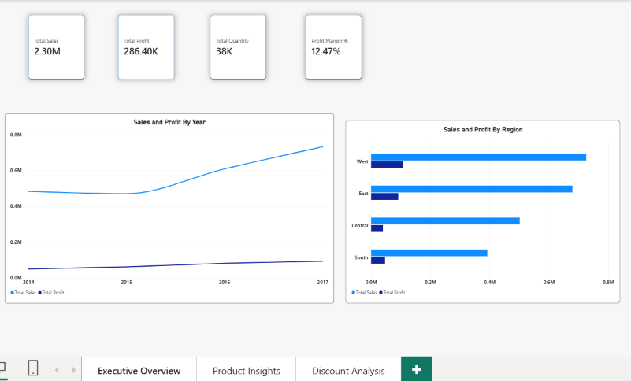
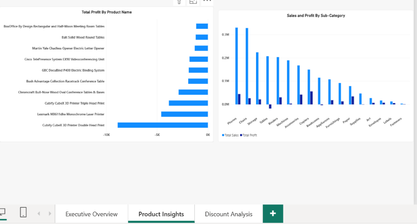
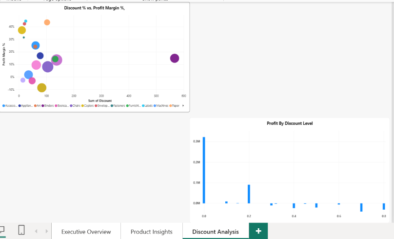

# Sales & Profitability Analysis Project

## Summary
This project investigates a classic retail dilemma: High revenue does not equal high profitability. Using a multi-tool data stack (Excel, Python, SQL, and Power BI), this analysis uncovers loss-making products, analyzes geographic sales efficiency, and evaluates the negative impact of high discounting on profit margins.

## The Tech Stack & Workflow
Each tool was chosen for a specific phase of the data lifecycle to mimic a real-world enterprise analytics workflow:
| Tool | Role in Project | Key Actions Taken |
| :--- | :--- | :--- |
| **Excel** | Data Auditing & Initial Exploration | Inspected raw data formats, checked for structural anomalies, and validated data types. |
| **Python (Pandas)** | ETL & Data Hygiene | Automated cleaning (stripping whitespace, formatting column headers, removing duplicates) and exported a pristine master dataset ('superstore_cleaned.csv'). |
| **SQL (SQLite)** | Analytical Deep-Dive | Queried category performance, identified top 10 loss-making products, and analyzed discount-to-profit elasticity. |
| **Power BI** | Stakeholder Storytelling | Built a dynamic 3-page interactive dashboard with custom DAX measures for executive presentation. |

## Power BI Dashboard Overview: The interactive report is structured around a three-page strategic narrative:

Executive Overview ("How healthy is the business?")High-level KPI banner: Total Sales, Total Profit, Total Quantity, and Weighted Profit Margin %.
Monthly trend lines and regional performance comparisons.

Product & Category Disconnect ("Where are we losing money?")
Side-by-side sub-category breakdown highlighting high-revenue vs. negative-profit items.
Filtered top 10 loss-making products matrix.

Discount Strategy & Profitability ("Are discounts destroying margins?")
Scatter plot mapping Discount % vs. Profit Margin % across sub-categories.
Clustered column analysis proving the exact threshold where discounting causes negative profitability.

## Project Repository Structure

```text
sales-and-profitability-analysis/
│
├── data/
│   ├── raw/                  # Original unedited superstore.csv
│   └── cleaned/              # ETL-processed master CSV ready for BI
│       └── superstore_cleaned.csv
├── python/
│   └── sql_analysis.py       # Automated cleaning script & SQLite loader
├── sql/
│   └── analysis_queries.sql  # Core analytical queries used for deep-dives
├── powerbi/
│   └── superstore_dashboard.pbix # Final interactive Power BI report
├── assets/                   # Dashboard screenshots
├── .gitignore
├── data_dictionary.md
└── README.md
```
## Key Business Insights
The Revenue Trap: Certain sub-categories generate impressive sales volume but operate at a net loss due to aggressive pricing or high shipping costs.

The Discount Cliff: Profit margins remain stable up to a 10–20% discount threshold, after which margins plunge sharply into negative territory, destroying profitability.

Geographic Variance: Regionally, sales efficiency varies significantly; some regions achieve high profit margins on lower total revenue compared to high-volume, low-margin regions.

## Dashboard Previews
Page 1: Executive Overview -> 

Page 2: Product Insights -> 

Page 3: Discount Analysis -> 
